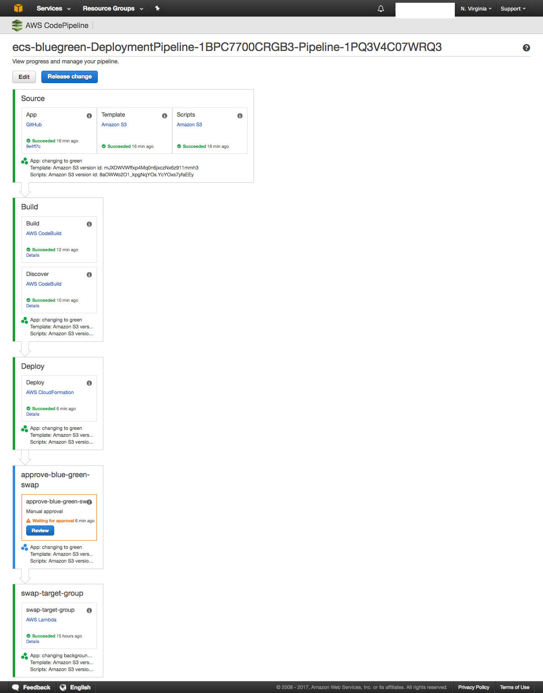

# Blue/Green deployments on ECS

This ReadMe is in reference to blog post on [blue green deployments on ECS][link]. 

## Pre-Requisites
This example uses [AWS Command Line Interface](http://docs.aws.amazon.com/cli/latest/userguide/cli-chap-welcome.html) to run Step-3 below.

If you haven't installed AWS CLI, please follow [instructions](http://docs.aws.amazon.com/cli/latest/userguide/installing.html). Your CLI [configuration](http://docs.aws.amazon.com/cli/latest/userguide/cli-chap-getting-started.html) need PowerUserAccess and IAMFullAccess [IAM policies](http://docs.aws.amazon.com/IAM/latest/UserGuide/access_policies.html) associated with your credentials

```console
aws --version
```

Output from above must yield **AWS CLI version >= 1.11.37** in order to continue further.

## Quick setup in three steps

#### 1. Fork ECS Sample app

[Fork](https://help.github.com/articles/fork-a-repo/) the [Amazon ECS sample app](https://github.com/awslabs/ecs-demo-php-simple-app) GitHub repository into your GitHub account.

Clone the ECS Sample app repo 
```console
git clone https://github.com/<your_github_username>/ecs-demo-php-simple-app
```

#### 2. Clone ECS blue green repo

```console
git clone https://github.com/awslabs/ecs-blue-green-deployment
```

#### 3. Run /bin/deploy
```console
/bin/deploy
```

Here are the inputs required to launch CloudFormation templates:
  * **S3 Bucket**: Enter S3 Bucket for storing your CloudFormation templates and scripts. This bucket must be in the same region where you wish to launch all the AWS resources created by this example.
  * **CloudFormation Stack Name**: Enter CloudFormation Stack Name to create stacks
  * **GitHubUser**: Enter your GitHub Username
  * **GitHubToken**: Enter your GitHub Token for authentication ([https://github.com/settings/tokens](https://github.com/settings/tokens))

Sit back and relax until all the resources are created for you. After the templates are created, you can open ELB DNS URL to see the ECS Sample App

For testing Blue Green deployment, Go ahead and make a change in ECS Sample App. For ex, edit src/index.php and update the background-color to #20E941 to change to Green background color. After commiting to your repo, Code Pipeline will pick the change automatically and go through the process of updating your application. 

Click on "Review" button in Code pipeline and Approve the change. Now you should see the new version of the application with Green background. 

## Resources created in this exercise

Count | AWS resources 
| --- | --- |
7   | AWS CloudFormation templates 
1   | Amazon VPC (10.215.0.0/16)   
1  | Code Pipeline 
2  | Code Build projects 
1  | Amazon S3 Bucket 
1  | AWS Lambda 
1  | Amazon ECS Cluster 
2  | Amazon ECS Service 
1  | Application Load Balancer 
2  | Application Load Balancer Target Groups 


## Implementation details
In this implementation, we create a continuous delivery pipeline using AWS CodePipeline that automates the build with AWS CodeBuild. During first phase, the parent template (ecs-blue-green-deployment.yaml) kicks off creating VPC and CodePipeline resources. Once the pipeline is complete, rest of the resources such as ALB, Target Groups, CodeBuild, ECS resources are instantiated. 

[][codepipeline]

We create two ECS service and associate one Target Group to each service (Blue and Green service) as depicted in the diagram. Blue Target Group (TG) is associated with Port 80 that represents Live traffic and Green TG is associated with Port 8080 which will serve as new version of the Application. During initial rollout, both Blue and Green service serve same application version. As you introduce new release, the changes are pulled via CodePipeline and pushed down the pipeline using CodeBuild and deployed to ECS as Green service using CloudFormation

[BlueGreen Diagram]

**During Build stage**

* During the first phase of build process, CodeBuild builds the docker container image and pushes to [Amazon ECR](https://aws.amazon.com/ecr/).
 This repository got created when deployment-pipeline.yaml was executed.
* During the second phase of the build process, Codebuild executes scripts/deployer.py , which executes the following scripted logic

  1. Retrieve artifact (build.json) from the previous phase (CodeBuild phase, which builds application container images)
  2. Check if the load balancer exists. Name of the ELB is fed through environment variable by the pipeline.
  3. Get tag key value of the target group, running on port 8080 and 80 with KeyName as "Identifier". It will be either "Code1" or "Code2"
  4. Get Sha or the image id running on target group at port 8080 and 80
  5. Edit the build.json retrieved from step-1 and append the values retrieved in step3 and step4
  6. Save the modified build.json. This file is the output from codebuild project and fed as an input to the CloudFormation
     execution stage.This json file has the following schema
      {
        "Code1" : "CONTAINER_TAG1",
        "Code2" : "CONTAINER_TAG2"
      }
  If the load balancer does not exists (as found in step-2), this would imply that the stack is executed for the first time, and the values of "CONTAINER_TAG1" and CONTAINER_TAG2" will be the same and default to the
  value retrieved from build.json in step-1

**During Deploy stage** 
CodePipeline executes templates/ecs-cluster.yaml. The CloudFormation input parameters with KeyName as "Code1" and "Code2" are overwritten with the values as written in the build.json, retrieved from the second phase of Build Stage.

**During Review stage** 
The pipeline offers manual "Review" button so that the approver can review code and Approve new release.
Providing approvals at this stage will trigger the Lambda function (blue_green_flip.py) which swaps the Green TG to Live traffic. You can checkout sample app to see new release change. You can also determine by reviewing ALB TG Tags. Blue TG IsProduction tag will say as False and Green TG will say True. If there are any issues with Production traffic, you can easily revert back to previous version by clicking "Review" button and Approving the change.
blue_green_flip.py has the following logic scripted

   1. Read Job Data from input json
   2. Read Job ID from input json
   3. Get parameters from input json
   4. Get Load balancer name from parameters
   5. Identify the TargetGroup running on this Load Balancer at port 80 and port 8080.Swap them. Also swap the values of "IsProduction" tags.
   6. Send success or failure to CodePipeline

## Cleanup
First delete ecs-cluster CloudFormation stack, this will also delete both ECS services (BlueService and GreenService) and LoadBalancer CloudFormation stacks. Next delete the parent stack 

If you used CloudFormation to create your stack, first delete ecs-cluster stack, delete s3 bucket, ECR repositories, then Delete parent stack to cleanup all resources


